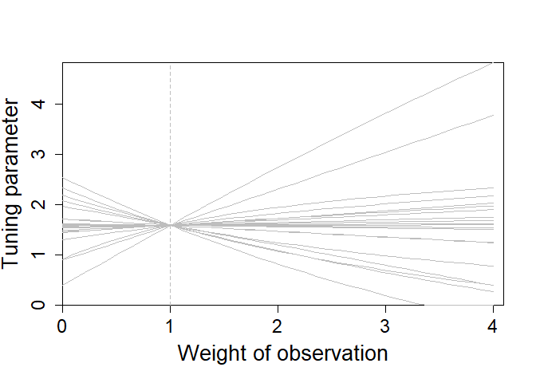
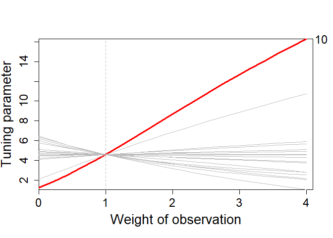
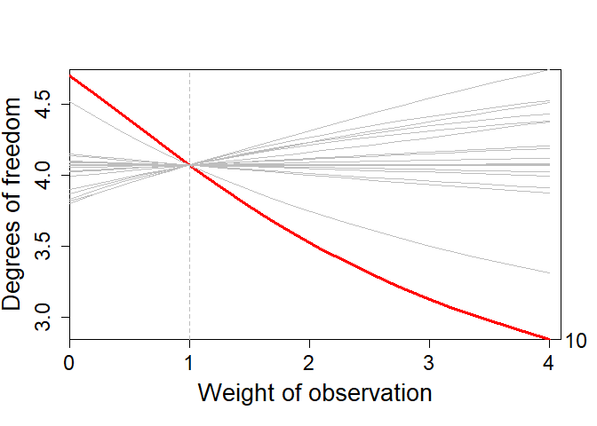
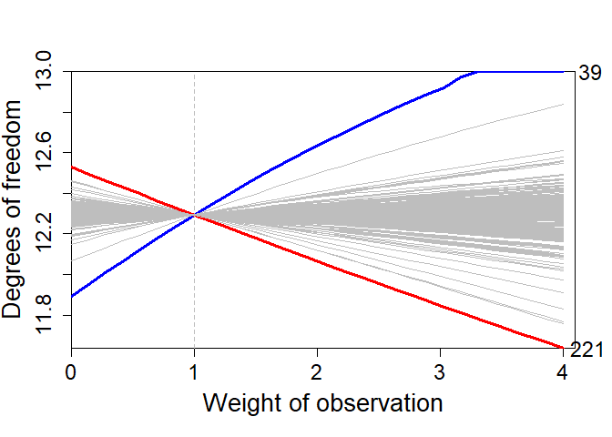

<!-- README.md is generated from README.Rmd. Please edit that file -->
<!-- usethis::use_readme_rmd() og så Ctlr + Shift + K -->

# influridge: Influence of single observations on the choice of the penalty parameter in ridge regression

This vignette describes how to use the R package influridge to identify
influential observations on the choice of the penalty parameter in ridge
regression. See the paper [Hellton, Lingjærde and De Bin
(2024)](https://www.tandfonline.com/doi/full/10.1080/00949655.2024.2440542)
for details.

# Installation

You can install the R package *influridge* directly from GitHub, after
installing the package devtools. The help description files can be
accessed by using ?

``` r

#Install and load the devtools package
install.packages("devtools")
library(devtools)

# Install the zibppca package directly from GitHub
install_github("khellton/influridge")

#Load the zibppca package
library(influridge)

#Check the help file
?influridge
```

# Graphical tool visualizing the tuning parameter

We demonstrate first the basic functionality of the package using
simulated data. The produced figure shows the optimal tuning parameter
when the weight of each single observation is changed.

``` r
p <- 5
n <- 20
sigma <- 1
beta <- rep(1, p)

## Simulating design matrix, X
set.seed(556)
X <- matrix(rnorm(n * p), n, p)

## Simulate outcome vector, Y
y <- X %*% beta + rnorm(n, 0, sigma)

## Plot curves (no highlighted shrinkers/expanders)
influridge(X, y)
```

<!-- -->

## Large shrinker

We adding a large positive residual to the 10th observation to create an
influential shrinker. We therefore add to the function that one shrinker
should be highlighted in red.

<!-- -->

## Degrees of freedom scale

We can visualize the same shrinker on the scale of degrees of freedom,
by changing the input to *degreeFreedom* to *TRUE*. The degrees of
freedom will be inverse to the scale of tuning parameter. For details
see for instance Section 5.2 [Hellton, Lingjærde and De Bin
(2024)](https://www.tandfonline.com/doi/full/10.1080/00949655.2024.2440542).

<!-- -->

## Bodyfat data set

We also illustrate our graphical procedure using the Bodyfat data set
(<https://lib.stat.cmu.edu/datasets/bodyfat>) analyzed in detail Section
5.1 [Hellton, Lingjærde and De Bin
(2024)](https://www.tandfonline.com/doi/full/10.1080/00949655.2024.2440542).

``` r
require(mfp)
#> Loading required package: mfp
#> Warning: package 'mfp' was built under R version 4.3.3
#> Loading required package: survival
data(bodyfat)
X <- bodyfat[, 6:17] # Omit non-continous age variable
y <- bodyfat$siri
n <- dim(X)[1]

X <- scale(X, center = FALSE) # Scale data
X <- cbind(rep(1, n), X) # Add intercept to design matrix

influridge(X, y, noShrink = 1, noExpand = 1, degreeFreedom = TRUE, nw = 30)
```

<!-- -->
